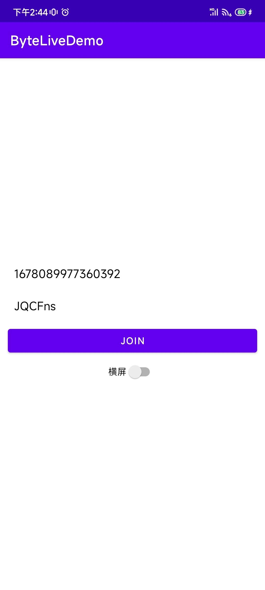

# BDLiveDemo_Android

企业直播在 GitHub 上提供开源示例项目 BDLiveDemo_Android 用于演示如何集成和使用企业直播 aPaaS SDK。该项目演示了如何通过少量代码接入完整直播间。

# 前提条件

- Android 5.0 及以上版本的真机。
- CPU 架构：armv7、arm64
- 安装 Android Studio，建议使用最新版本。
- 联系企业直播技术支持获取 TTSDK License 文件和 AppID。License 是使用 TTSDK 对应模块的鉴权凭证。

# 操作步骤

1. 在终端中运行以下命令，将 BDLiveDemo_Android 仓库克隆至本地：

```
git clone https://github.com/volcengine/BDLiveDemo_Android.git
```

2. 使用AndroidStudio打开BDLiveDemo_Android项目。

3. 将获取到的TTSDK点播和直播License文件复制到 根目录/app/src/main/assets/lic/下，文件结构如下：

   ```
   app
   |-- src
       |-- main
           |-- java
           |-- assets
               |-- lic
                   |--  liveLicense.lic
                   |--  vodLicense.lic

4. 修改app/build.gradle中的applicationId为申请TTSDK License所填的App包名

5. 找到项目中的MyApplication类，填写缺失的鉴权相关信息

   ```Java
   public class MyApplication extends Application {
   
       public final static String mAppId = "";//申请 TTSDK License 时使用的 AppId，请联系技术支持获取。
       public final static String mAppName = "";// 申请 TTSDK License 时使用的 AppName，请联系技术支持获取。
       public final static String mRegion = "";// 申请 TTSDK License 时使用的 region，即 china。
       private final static String mVersion = "";//App 版本号
       private final static String mChannel = "";// App渠道名
       private final static String mLiveLicenseUri = "";//直播License Uri,如放在assets/lic文件夹，示例：assets:///lic/xxx.lic
       private final static String mVodLicenseUri = "";//点播License Uri,如放在assets/lic文件夹，示例：assets:///lic/xxx.lic
       
   //xxx
   }
   ```

   

> 💡 注意  
> 您需要确保以下事项，否则会出现鉴权失败的问题：
>
> - TTSDK License 文件对应的 AppID 与初始化 BDLive SDK 时的AppID 一致。
> - TTSDK License 文件对应的 App包名 和项目配置的 applicationId 一致。

6. 使用AndroidStudio运行项目到真机上启动Demo App

7. 打开应用后，您可以看到以下界面。此处预填了企业直播官方 Demo 直播间的 Activity ID 和 token。点击 Join 即可进入直播间。

   

# 更多文档

[产品动态](https://www.volcengine.com/docs/3019/101242)
[集成 SDK](https://www.volcengine.com/docs/3019/101257)  

